# Projet SIEM/EDR avec Wazuh sur AWS

## Informations Générales

**Institution:** ENSET Mohammedia - Département Mathématique et Informatique  
**Filière:** II-BDCC-2  
**Sujet:** Déploiement d'une plateforme de sécurité Wazuh (SIEM/EDR) sur AWS

---

## 1. Introduction

Dans un contexte où les infrastructures Cloud sont de plus en plus exposées aux cybermenaces, la mise en place de mécanismes de supervision et de détection devient essentielle. Cet atelier déploie une plateforme complète de sécurité basée sur **Wazuh**, combinant les approches **SIEM** (Security Information and Event Management) et **EDR** (Endpoint Detection and Response), au sein d'un environnement AWS.

L'étude de cas repose sur un environnement multi-systèmes comprenant:
- Un serveur central de supervision
- Deux endpoints (Linux et Windows)
- Une illustration de scénarios réels de sécurité et leur analyse dans un SOC moderne

---

## 2. Objectifs du Projet

Ce travail pratique vise à:

1. **Comprendre le rôle d'un SIEM/XDR** dans la sécurisation des systèmes d'information
2. **Déployer un serveur Wazuh** dans un environnement cloud AWS
3. **Installer et configurer des agents Wazuh** sur différentes machines clientes (Linux et Windows)
4. **Établir une communication fiable** entre le serveur central et les agents
5. **Vérifier la collecte et l'analyse des logs** de sécurité
6. **Observer et interpréter les alertes** générées via le tableau de bord Wazuh

---

## 3. Présentation des Outils Utilisés

### 3.1 Wazuh

**Wazuh** est la solution principale choisie pour:
- La collecte et l'analyse des logs
- La détection d'intrusions
- Le contrôle d'intégrité des fichiers (FIM)
- La centralisation des informations de sécurité
- La génération d'alertes en temps réel

### 3.2 SIEM (Security Information and Event Management)

Le SIEM offre:
- Une **vision globale et centralisée** de la sécurité
- Une **analyse multi-systèmes**
- La **corrélation des logs** provenant de diverses sources
- Une surveillance continue de l'infrastructure

### 3.3 EDR (Endpoint Detection and Response)

L'EDR fournit:
- Une **vision locale et détaillée** des endpoints
- Une **analyse comportementale** au niveau des postes
- La **surveillance des actions locales** (création d'utilisateurs, modifications système, etc.)

### 3.4 Différence et Complémentarité SIEM/EDR

| Caractéristique | SIEM | EDR |
|----------------|------|-----|
| **Vision** | Globale et centralisée | Locale et détaillée |
| **Analyse** | Multi-systèmes | Comportementale endpoint |
| **Focus** | Corrélation des logs | Surveillance des actions locales |

**Note:** Wazuh permet de combiner SIEM et EDR dans une même plateforme, offrant ainsi une visibilité complète sur l'infrastructure et les endpoints.

### 3.5 Infrastructure AWS

L'infrastructure cloud est basée sur **Amazon Web Services (AWS)**, offrant:
- Un environnement flexible et sécurisé
- Des instances **EC2** pour héberger le serveur Wazuh et les clients
- Des **Security Groups** pour le contrôle du trafic
- Un **VPC** pour l'isolation réseau

### 3.6 Systèmes d'Exploitation

- **Ubuntu Server 22.04 LTS**: pour le serveur Wazuh et le client Linux
- **Windows Server**: pour simuler un environnement d'entreprise

### 3.7 Outils Complémentaires

- **SSH**: administration des machines Linux
- **PowerShell**: administration Windows
- **Navigateur web**: accès au tableau de bord Wazuh

---

## 4. Architecture du Laboratoire

L'architecture repose sur une infrastructure Cloud AWS conçue de manière isolée et sécurisée.

### Composants Principaux

#### Serveur Central
- **Wazuh All-in-One** sur instance Ubuntu
- Rôles combinés:
  - Wazuh Manager (gestion des agents)
  - Indexer (stockage des données)
  - Dashboard (visualisation)

#### Machines Clientes
1. **Client Linux (Ubuntu)**: serveur/poste Linux classique avec agent Wazuh
2. **Client Windows Server**: environnement d'entreprise avec agent Wazuh

#### Sécurité Réseau
- **VPC unique**: contrôle total du trafic réseau
- **Security Groups**: règles de sécurité strictes
- **Ports autorisés**: uniquement ceux nécessaires au fonctionnement

### Schéma d'Architecture

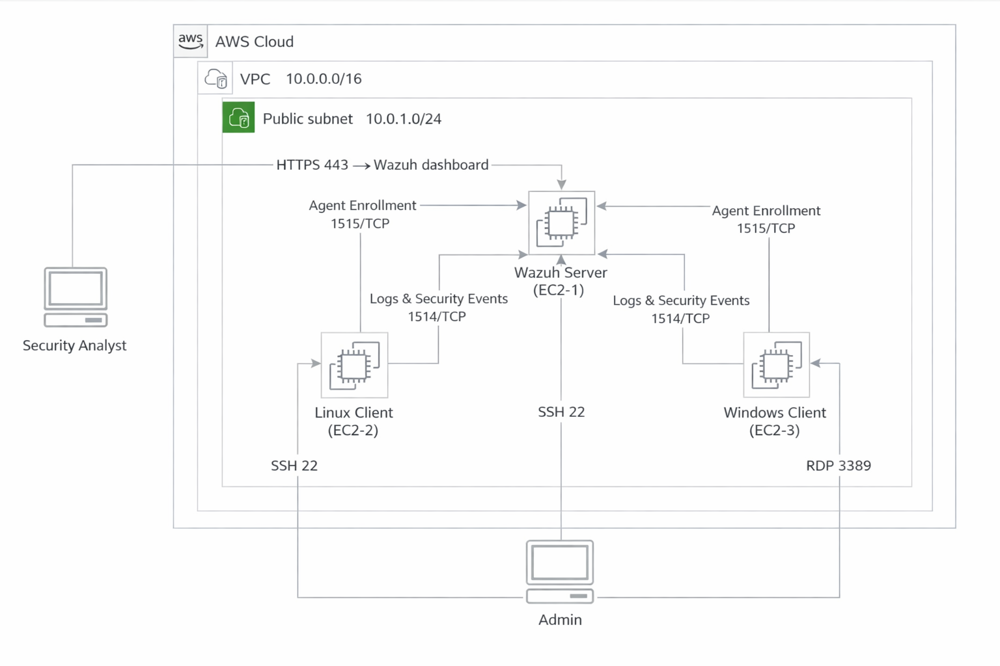

---

## 5. Étapes de Réalisation du Projet

### 5.1 Création du Virtual Private Cloud (VPC)

#### Objectif
Isoler et sécuriser l'infrastructure réseau du projet dans AWS.

#### Actions Réalisées

1. **Création du VPC**: `VPC-SIEM-LAB`
   - Plage d'adresses IP privée adaptée au projet
  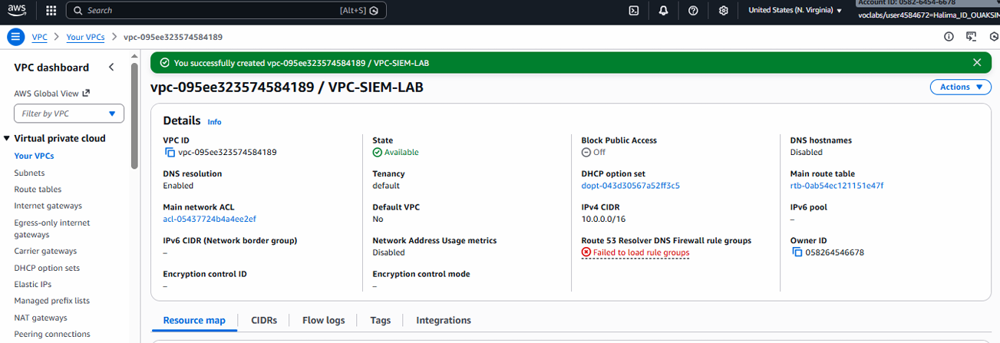

1. **Configuration du Subnet Public**: `Subnet-Public-SIEM`
   - Permet l'accès aux instances depuis Internet
  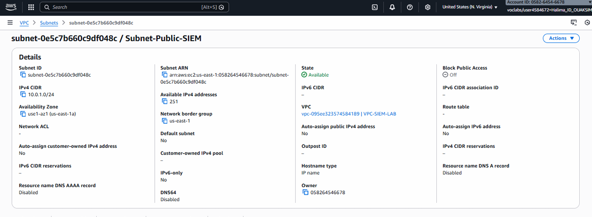
2. **Association d'une Internet Gateway**: `IGW-SIEM`
   - Assure la connectivité externe
    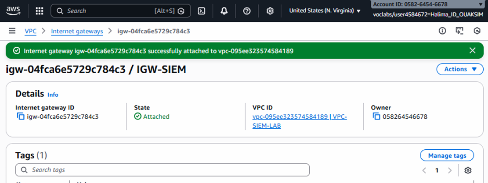
1. **Configuration de la Table de Routage**: `RT-Public-SIEM`
   - Dirige le trafic sortant vers Internet
    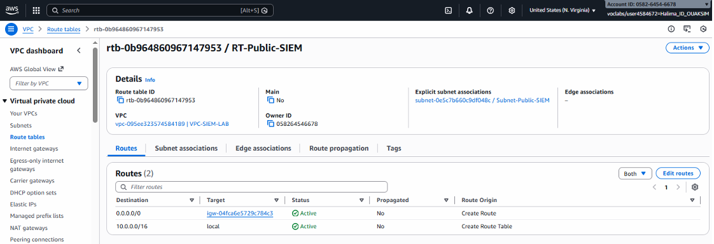

### 5.2 Configuration des Groupes de Sécurité

#### 5.2.1 Groupe de Sécurité du Serveur Wazuh

**Nom**: `SG-Wazuh-Server`

**Ports Entrants Autorisés**:

| Port | Protocole | Usage |
|------|-----------|-------|
| 22 | TCP | SSH - Administration à distance |
| 443 | TCP | HTTPS - Accès au dashboard Wazuh |
| 1514 | TCP/UDP | Communication serveur-agents |
| 1515 | TCP | Enregistrement et authentification des agents |

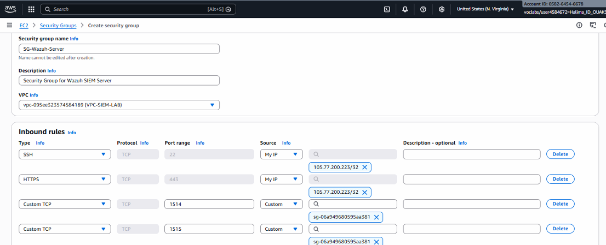
#### 5.2.2 Groupe de Sécurité des Clients

**Nom**: `SG-Clients`

**Caractéristiques**:
- Trafic sortant autorisé vers le serveur Wazuh
- Accès entrants limités à l'administration:
  - **Port 22 (SSH)**: pour Linux
  - **Port 3389 (RDP)**: pour Windows

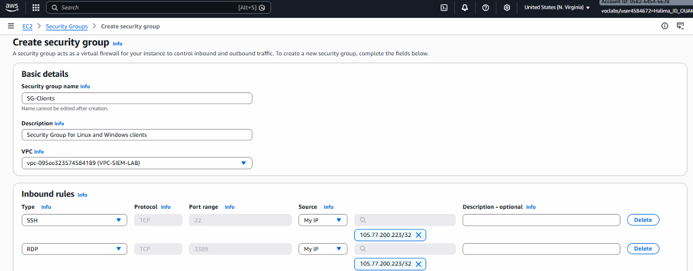
### 5.3 Création des Instances EC2

#### 5.3.1 Instance Principale (Serveur Wazuh)

**Nom**: `Wazuh-Server`

**Spécifications**:
- **OS**: Ubuntu Server 22.04 LTS
 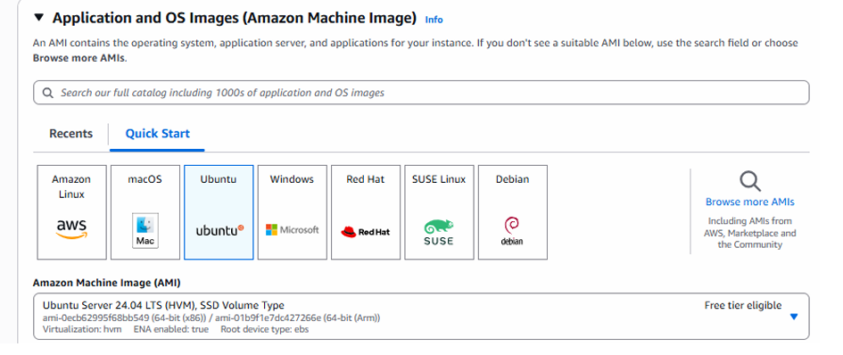
- **Rôles**: Manager + Indexer + Dashboard
- **Type d'instance**: Configuration adaptée (t2.large ou supérieur recommandé)
- **Key Pair**: Paire de clés pour accès SSH sécurisé
  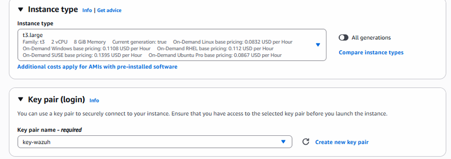
-  **Stockage**: Volume EBS approprié
- **Security Group**: SG-Wazuh-Server
  
- **Subnet**: Subnet-Public-SIEM


#### 5.3.2 Client Linux

**Nom**: `Linux-Client`

**Spécifications**:
- **OS**: Ubuntu Server 22.04 LTS
  
- **Rôle**: Machine supervisée avec agent Wazuh
- **Type d'instance**: t2.micro (suffisant pour un agent)
  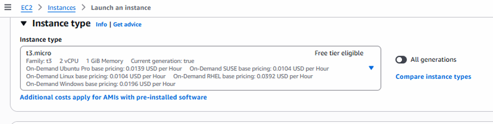
- **Security Group**: SG-Clients
  
- **Subnet**: Subnet-Public-SIEM

#### 5.3.3 Client Windows Server

**Nom**: `Windows-Client`

**Spécifications**:
- **OS**: Windows Server (version récente)
  
- **Rôle**: Simulation d'environnement d'entreprise avec agent Wazuh
- **Type d'instance**: t2.medium ou supérieur
  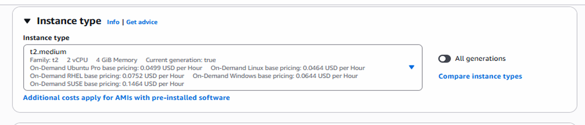
- **Security Group**: SG-Clients
  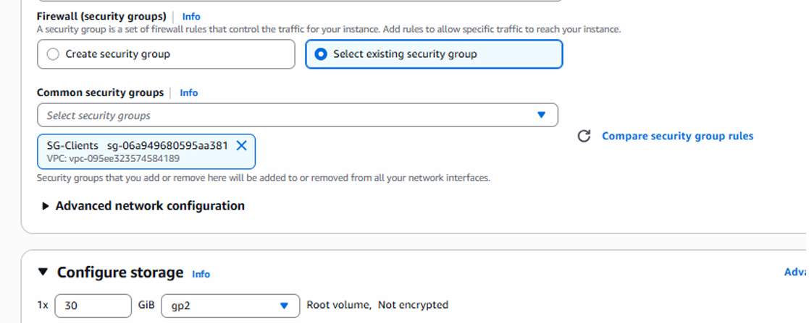
- **Subnet**: Subnet-Public-SIEM

### 5.4 Connexion au Serveur Wazuh

#### 5.4.1 Installation de Wazuh

**Connexion SSH**:
```bash
ssh -i "votre-cle.pem" ubuntu@<IP_PUBLIQUE_SERVEUR>
```

**Script d'Installation**:
```bash
# Mise à jour du système
sudo apt update && sudo apt -y upgrade

# Téléchargement du script d'installation Wazuh
curl -sO https://packages.wazuh.com/4.7/wazuh-install.sh

# Lancement de l'installation automatique
sudo bash wazuh-install.sh -a
```

**Composants Installés**:
- Wazuh Manager
- Wazuh Indexer
- Wazuh Dashboard

**Vérification**:
```bash
# Vérifier l'état des services
sudo systemctl status wazuh-manager
sudo systemctl status wazuh-indexer
sudo systemctl status wazuh-dashboard
```

#### 5.4.2 Accès au Wazuh Dashboard

**URL d'accès**:
```
https://<IP_PUBLIQUE_SERVEUR>
```

**Identifiants**:
- Les identifiants par défaut sont affichés à la fin de l'installation
- Il est recommandé de les changer immédiatement
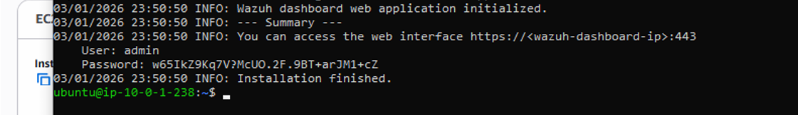
**Fonctionnalités**:
- Supervision de tous les agents connectés
- Analyse des logs en temps réel
- Visualisation des alertes de sécurité
- Tableaux de bord personnalisables

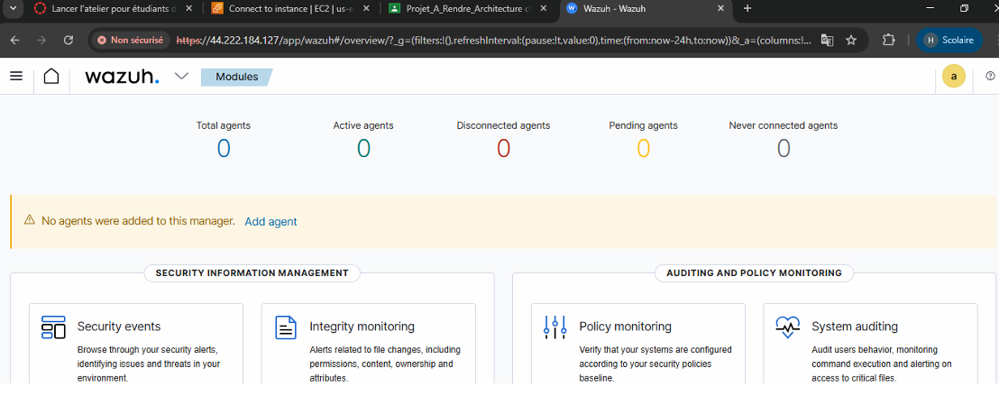
### 5.5 Installation de l'Agent Wazuh sur Linux

#### Étapes d'Installation

**1. Depuis le Dashboard Wazuh**:
- Naviguer vers "Deploy new agent"
- Sélectionner le type d'OS: Linux (DEB/RPM)
  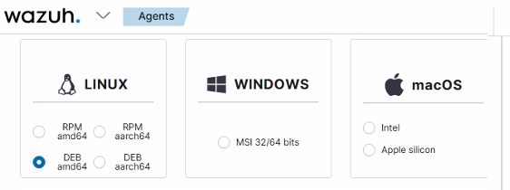
- Spécifier l'adresse IP du serveur Wazuh
    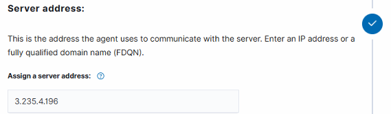
- Copier les commandes générées
  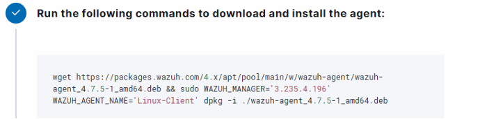

**2. Sur la Machine Cliente Linux**:
```bash
# Télécharger et installer l'agent
wget https://packages.wazuh.com/4.x/apt/pool/main/w/wazuh-agent/wazuh-agent_4.7.0-1_amd64.deb
sudo WAZUH_MANAGER='<IP_SERVEUR_WAZUH>' dpkg -i wazuh-agent_4.7.0-1_amd64.deb

# Démarrer le service
sudo systemctl daemon-reload
sudo systemctl enable wazuh-agent
sudo systemctl start wazuh-agent

# Vérifier le statut
sudo systemctl status wazuh-agent
```

**3. Vérification sur le Dashboard**:
- L'agent apparaît dans la liste des agents actifs
- Le statut doit être "Active"
- Les premiers événements commencent à remonter
  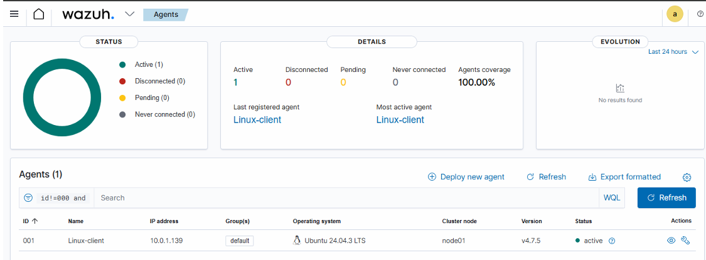

### 5.6 Installation de l'Agent Wazuh sur Windows

#### Étapes d'Installation

**1. Téléchargement de l'Installateur**:
- Depuis le dashboard Wazuh ou le site officiel
- Fichier MSI pour Windows

**2. Installation via PowerShell (Administrateur)**:
```powershell
# Installation avec spécification du manager
msiexec.exe /i wazuh-agent-4.7.0-1.msi /q WAZUH_MANAGER='<IP_SERVEUR_WAZUH>'

# Démarrer le service
NET START WazuhSvc
```
  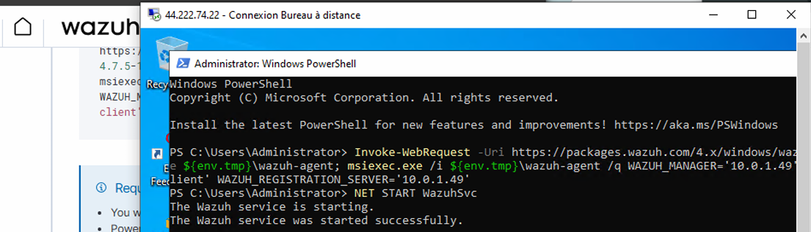

**3. Vérification**:
```powershell
# Vérifier le statut du service
Get-Service WazuhSvc

# Consulter les logs
Get-Content "C:\Program Files (x86)\ossec-agent\ossec.log"
```

**4. Confirmation sur le Dashboard**:
- L'agent Windows apparaît dans la liste
- Vérifier la connectivité et les événements remontés

  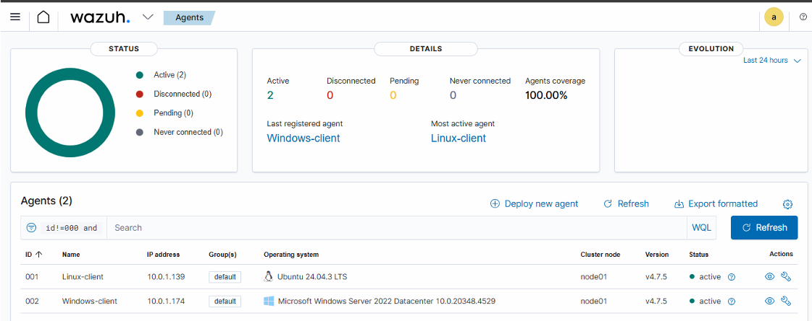
---

## 6. Démonstration SIEM (Linux)

### 6.1 Tentatives d'Authentification SSH Échouées

#### Objectif
Simuler une attaque par force brute SSH pour générer des alertes.

#### Test Effectué
```bash
# Tentatives de connexion avec un utilisateur inexistant
ssh fakeuser@<IP_LINUX_CLIENT>
ssh wronguser@<IP_LINUX_CLIENT>
ssh invaliduser@<IP_LINUX_CLIENT>
```
  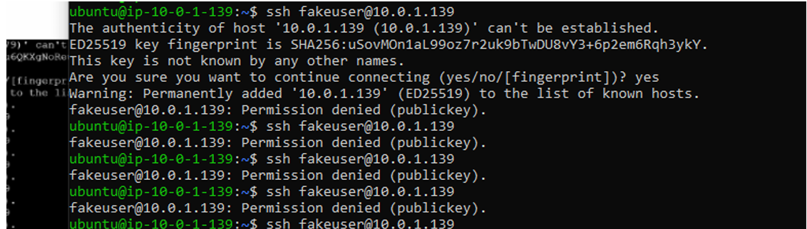
#### Résultats Observés
- **Alerte générée**: "SSH authentication failed"
- **Niveau de sévérité**: Medium/High selon le nombre de tentatives
- **Informations collectées**:
  - Adresse IP source
  - Nombre de tentatives échouées
  - Utilisateurs tentés
  - Horodatage précis

#### Analyse SOC
Cette alerte permet de détecter:
- Les tentatives de force brute
- Les scans de services SSH
- Les activités suspectes d'authentification

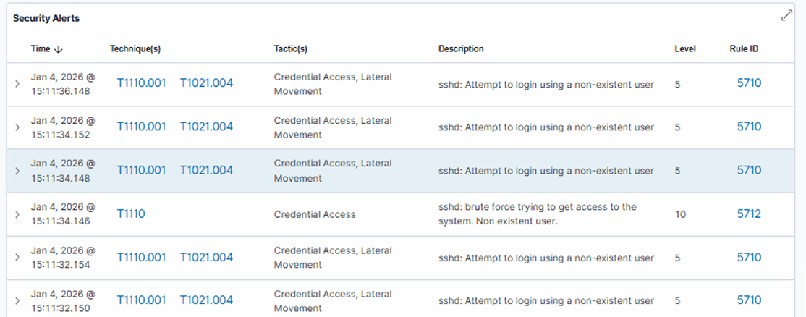
### 6.2 Élévation de Privilèges

#### Objectif
Détecter l'utilisation de commandes privilégiées avec sudo.

#### Test Effectué
```bash
# Connexion sur le client Linux
sudo su
whoami
exit
```
  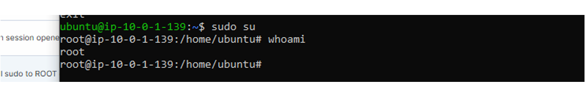
#### Résultats Observés
- **Événement détecté**: "Successful sudo to ROOT executed"
- **Informations capturées**:
  - Utilisateur qui a exécuté sudo
  - Commande exécutée
  - Résultat (succès/échec)
  - Contexte temporel
  
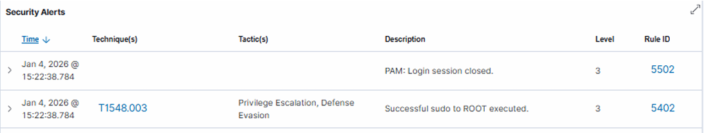

#### Importance
- Audit des élévations de privilèges
- Détection d'abus de droits
- Conformité (traçabilité des actions admin)

### 6.3 File Integrity Monitoring (FIM)

#### Objectif
Surveiller les modifications de fichiers sensibles du système.

#### Test Effectué
```bash
# Modification du fichier /etc/passwd (ajout d'un utilisateur fictif)
sudo echo "test" | sudo tee -a /etc/passwd
```

#### Résultats Observés
- **Alerte FIM**: "Integrity checksum changed"
- **Fichier concerné**: `/etc/passwd`
- **Détails**:
  - Ancienne et nouvelle somme de contrôle (checksum)
  - Type de modification (ajout, suppression, modification)
  - Utilisateur responsable (si identifiable)

#### Fichiers Surveillés par Défaut
- `/etc/passwd`
- `/etc/shadow`
- `/etc/hosts`
- `/etc/ssh/sshd_config`
- Autres fichiers système critiques
  
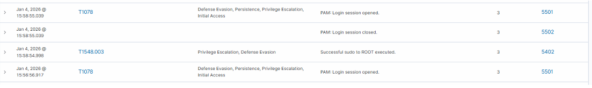
#### Cas d'Usage
- Détection de compromission système
- Surveillance des modifications non autorisées
- Conformité réglementaire (PCI-DSS, ISO 27001)

---

## 7. Démonstration EDR (Windows)

### 7.1 Échecs de Connexion

#### Objectif
Détecter les tentatives de connexion RDP échouées, indicateur potentiel d'attaque.

#### Test Effectué
```
# Tentatives de connexion RDP avec des identifiants incorrects
Utilisateur: admin
Mot de passe: (incorrect)

Utilisateur: administrator
Mot de passe: (incorrect)
```
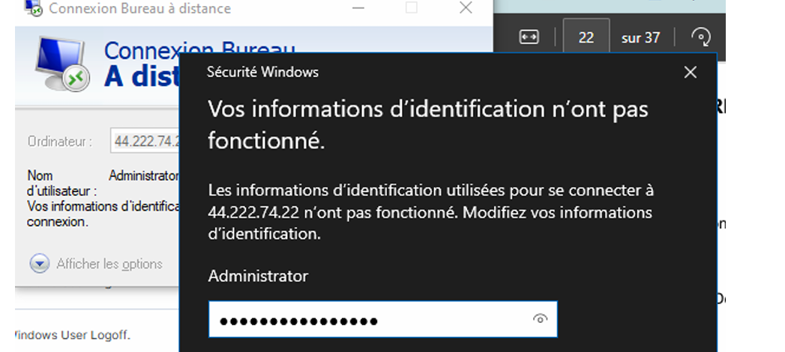
#### Résultats Observés
- **Alerte générée**: "Windows Logon Failure" (Event ID 4625)
- **Informations collectées**:
  - Compte utilisé pour la tentative
  - Type d'authentification (RDP/Network)
  - Adresse IP source
  - Raison de l'échec (mot de passe incorrect, compte inexistant, etc.)

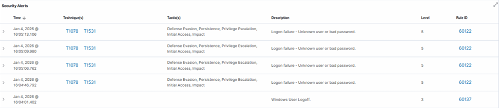
#### Analyse
- Permet de détecter:
  - Attaques par force brute sur RDP
  - Tentatives d'accès non autorisées
  - Potentielles compromissions de comptes

### 7.2 Gestion des Utilisateurs

#### Objectif
Surveiller la création et la modification de comptes utilisateurs locaux.

#### Tests Effectués
```powershell
# Création d'un nouvel utilisateur local
net user labuser P@ssw0rd! /add

# Ajout de l'utilisateur au groupe Administrateurs
net localgroup administrators labuser /add
```
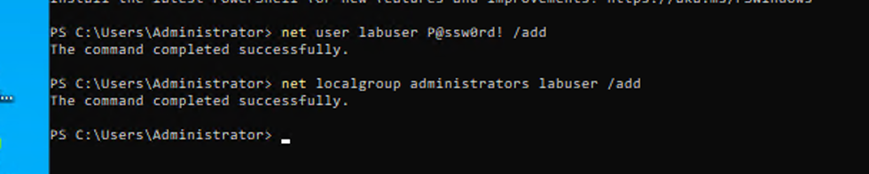
#### Résultats Observés

**1. Création d'utilisateur**:
- **Événement**: "A user account was created" (Event ID 4720)
- **Détails**:
  - Nom du nouvel utilisateur
  - Compte qui a créé l'utilisateur
  - Horodatage

**2. Modification de groupe**:
- **Événement**: "A member was added to a security-enabled local group" (Event ID 4732)
- **Détails**:
  - Utilisateur ajouté
  - Groupe cible (Administrators)
  - Compte effectuant l'action

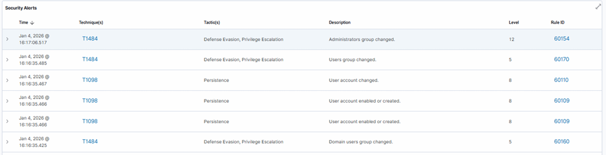
#### Importance pour la Sécurité
- **Détection de persistance**: création de backdoor accounts
- **Élévation de privilèges**: ajout illégitime aux groupes admin
- **Conformité**: audit des modifications de comptes
- **Investigation**: traçabilité des actions d'administration

#### Règles de Détection
Wazuh peut générer des alertes spécifiques pour:
- Création de comptes en dehors des heures ouvrables
- Ajout au groupe Administrateurs par des comptes non autorisés
- Création massive de comptes (comportement suspect)

---

## 8. Analyse et Supervision SOC

### Vue d'Ensemble

Le tableau de bord Wazuh offre une vision complète de la sécurité de l'infrastructure à travers plusieurs modules clés.

### Modules Principaux

#### 8.1 Security Events

**Fonctionnalités**:
- Vue chronologique de tous les événements de sécurité
- Filtrage par:
  - Agent
  - Niveau de sévérité
  - Type d'événement
  - Période temporelle
- Corrélation automatique des événements

**Métriques Visibles**:
- Nombre total d'événements
- Distribution par gravité (Low, Medium, High, Critical)
- Top des règles déclenchées
- Timeline des alertes

#### 8.2 Threat Hunting

**Capacités**:
- Recherche proactive de menaces
- Requêtes personnalisées sur les logs
- Analyse comportementale
- Détection d'anomalies

**Cas d'Usage**:
- Recherche d'indicateurs de compromission (IOC)
- Investigation d'incidents
- Analyse post-mortem
- Détection de menaces persistantes avancées (APT)

#### 8.3 Dashboard Multi-Agents

**Vue Centralisée**:
- État de tous les agents (Active, Disconnected, Never connected)
- Santé globale de l'infrastructure
- Distribution géographique (si configurée)
- Statistiques par système d'exploitation

**Informations par Agent**:
- Dernière connexion
- Version de l'agent
- Adresse IP
- Système d'exploitation
- Nombre d'alertes générées

#### 8.4 Compliance et Conformité

**Standards Supportés**:
- PCI-DSS
- GDPR
- HIPAA
- ISO 27001
- NIST 800-53

**Rapports Disponibles**:
- État de conformité en temps réel
- Écarts identifiés
- Recommandations de remédiation

### Statistiques du Laboratoire

**Agents Déployés**: 2
- 1 Linux (Ubuntu)
- 1 Windows (Windows Server)

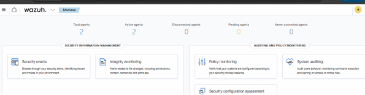

**Types d'Événements Générés**:
- Authentification (SSH, RDP)
- Élévation de privilèges (sudo)
- Modifications de fichiers (FIM)
- Gestion des utilisateurs
- Événements système

**Alertes Critiques Simulées**:
- Tentatives de force brute
- Modifications non autorisées
- Créations de comptes administrateurs

---

### 9 Enrichissement EDR avec Sysmon (Optionnel mais Recommandé)

#### Objectif
Installer Sysmon (System Monitor) sur le client Windows pour enrichir significativement les événements de sécurité collectés. Sysmon fournit des logs détaillés sur les processus, connexions réseau et activités suspectes, transformant Wazuh en une véritable solution EDR avancée.

#### Avantages de l'Intégration Sysmon + Wazuh

**Visibilité Accrue**:
- Détection de processus malveillants (malware, ransomware)
- Surveillance des connexions réseau suspectes
- Traçabilité complète des chaînes d'exécution de processus
- Détection de techniques d'évasion et de persistence

**Cas d'Usage EDR**:
- Analyse comportementale avancée
- Détection de Living-off-the-Land (LoLBins)
- Identification de Command & Control (C2)
- Investigation forensique approfondie

#### Étapes d'Installation et Configuration

**1. Téléchargement de Sysmon**

```powershell
# Télécharger Sysmon depuis Microsoft Sysinternals
Invoke-WebRequest -Uri "https://download.sysinternals.com/files/Sysmon.zip" -OutFile "C:\Temp\Sysmon.zip"

# Extraire l'archive
Expand-Archive -Path "C:\Temp\Sysmon.zip" -DestinationPath "C:\Temp\Sysmon"
```

**2. Téléchargement d'une Configuration Sysmon**

Il est recommandé d'utiliser une configuration communautaire optimisée, comme celle de SwiftOnSecurity:

```powershell
# Télécharger la configuration SwiftOnSecurity
Invoke-WebRequest -Uri "https://raw.githubusercontent.com/SwiftOnSecurity/sysmon-config/master/sysmonconfig-export.xml" -OutFile "C:\Temp\sysmonconfig.xml"
```

**Configuration alternative - ION-Storm** (plus détaillée):
```powershell
Invoke-WebRequest -Uri "https://raw.githubusercontent.com/ion-storm/sysmon-config/master/sysmonconfig-export.xml" -OutFile "C:\Temp\sysmonconfig.xml"
```
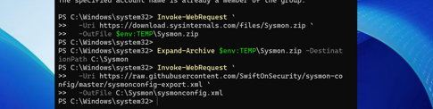
**3. Installation de Sysmon**

```powershell
# Se positionner dans le répertoire Sysmon
cd C:\Temp\Sysmon

# Installer Sysmon avec la configuration (en mode Administrateur)
.\Sysmon64.exe -accepteula -i C:\Temp\sysmonconfig.xml
```

**Vérification de l'installation**:
```powershell
# Vérifier que le service Sysmon est actif
Get-Service Sysmon64
```
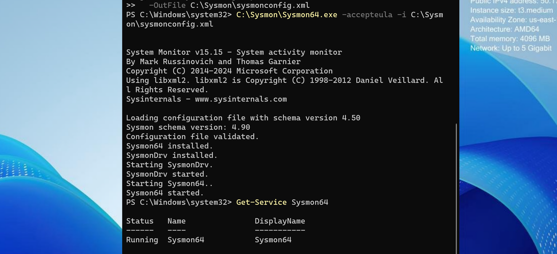

**4. Configuration de Wazuh pour Collecter les Logs Sysmon**

Sur le client Windows, éditer le fichier de configuration de l'agent Wazuh:

```powershell
# Ouvrir le fichier de configuration (en Administrateur)
notepad "C:\Program Files (x86)\ossec-agent\ossec.conf"
```

**Ajouter la configuration suivante dans la section `<ossec_config>`**:

```xml
<ossec_config>
  <!-- Configuration existante... -->
  
  <!-- Collecte des événements Sysmon -->
  <localfile>
    <location>Microsoft-Windows-Sysmon/Operational</location>
    <log_format>eventchannel</log_format>
  </localfile>
</ossec_config>
```


#### Événements Sysmon Collectés

Sysmon génère différents types d'événements (Event IDs) particulièrement utiles pour l'EDR:

| Event ID | Nom | Description | Utilité EDR |
|----------|-----|-------------|-------------|
| **1** | Process Creation | Création de processus | Détection de malware, chaînes d'exécution |
| **2** | File Creation Time Changed | Modification timestamp fichier | Anti-forensics, timestomping |
| **3** | Network Connection | Connexion réseau | C2, exfiltration de données |
| **5** | Process Terminated | Fin de processus | Analyse comportementale |
| **7** | Image Loaded | Chargement de DLL | DLL hijacking, injection |
| **8** | CreateRemoteThread | Création thread distant | Injection de code, malware |
| **10** | Process Access | Accès à un processus | Credential dumping (mimikatz) |
| **11** | File Created | Création de fichier | Ransomware, dropper |
| **12/13/14** | Registry Events | Modifications registre | Persistence, configuration malware |
| **15** | FileStream Created | Création ADS | Fichiers cachés, évasion |
| **22** | DNS Query | Requête DNS | Détection de domaines malveillants |

#### Tableau de bord Wazuh
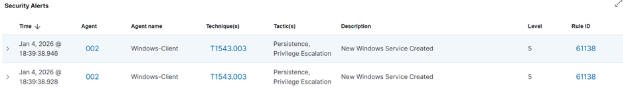
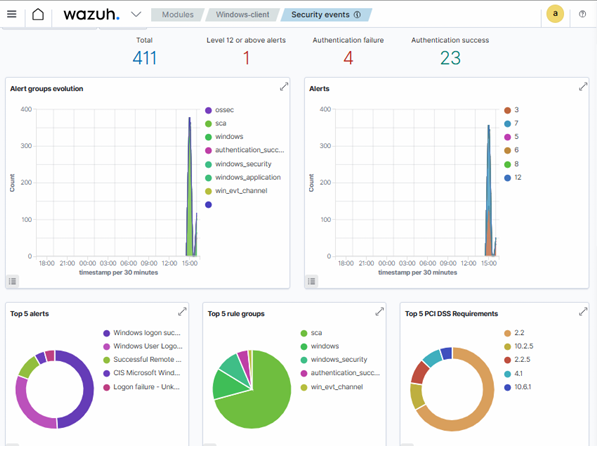


## 10. Conclusion

### Bilan du Projet

Cet atelier a permis de déployer avec succès une infrastructure de supervision de sécurité complète dans un environnement Cloud réel. La mise en œuvre de Wazuh sur AWS démontre concrètement l'importance des solutions SIEM et EDR dans:

- **La détection des menaces**: identification proactive des activités suspectes
- **La gestion des accès**: surveillance des authentifications et des privilèges
- **La surveillance continue**: monitoring 24/7 des endpoints
- **La conformité**: audit et traçabilité des événements de sécurité

### Compétences Acquises

Ce travail pratique a permis de maîtriser:

1. **Infrastructure Cloud (AWS)**:
   - Configuration de VPC et networking
   - Gestion d'instances EC2
   - Sécurisation avec Security Groups

2. **Sécurité Opérationnelle (SecOps)**:
   - Déploiement d'une solution SIEM/EDR
   - Configuration et gestion d'agents
   - Analyse de logs et d'alertes

3. **Concepts SOC**:
   - Corrélation d'événements multi-sources
   - Investigation d'incidents
   - Threat Hunting
   - Gestion de la conformité

4. **IAM/PAM**:
   - Surveillance des accès et des privilèges
   - Détection d'élévations de privilèges non autorisées
   - Audit des modifications de comptes

---

**Document préparé par**: Étudiants de la filière II-BDCC-2  
**Institution**: ENSET Mohammedia  
**Date**: 2025  
**Version**: 1.0

